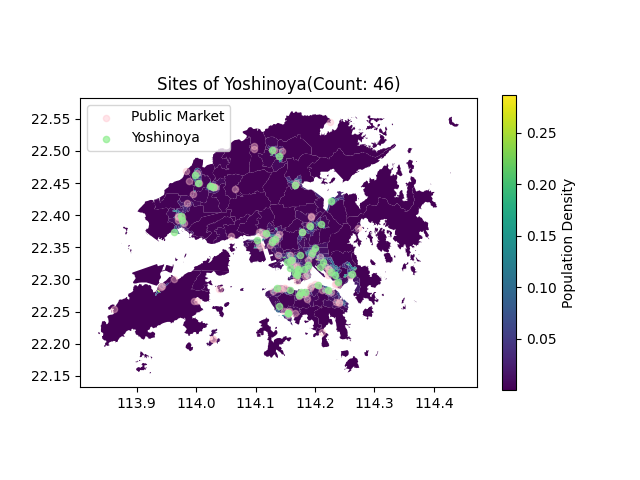
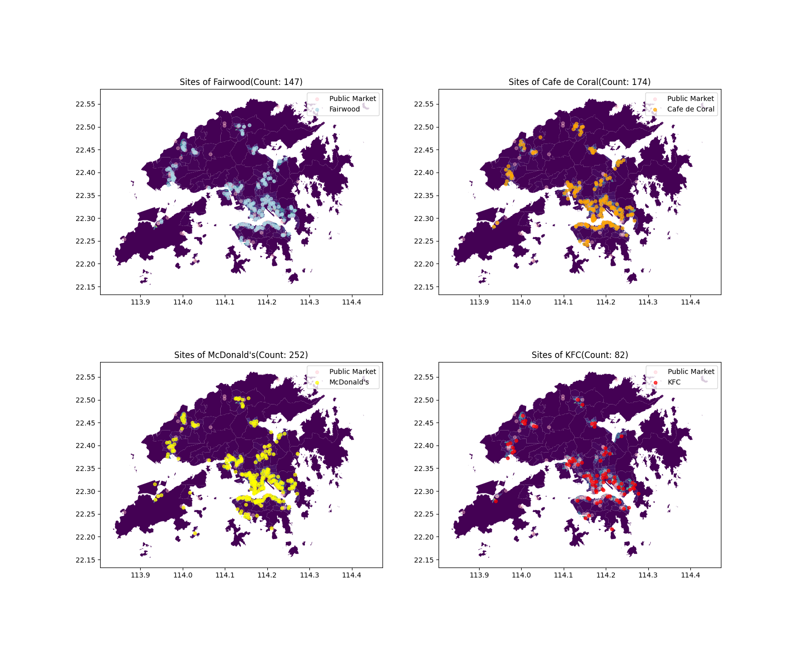
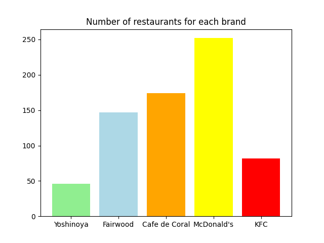
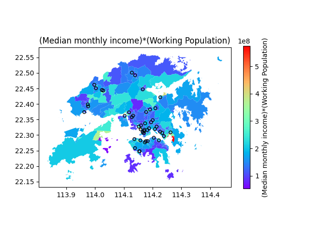
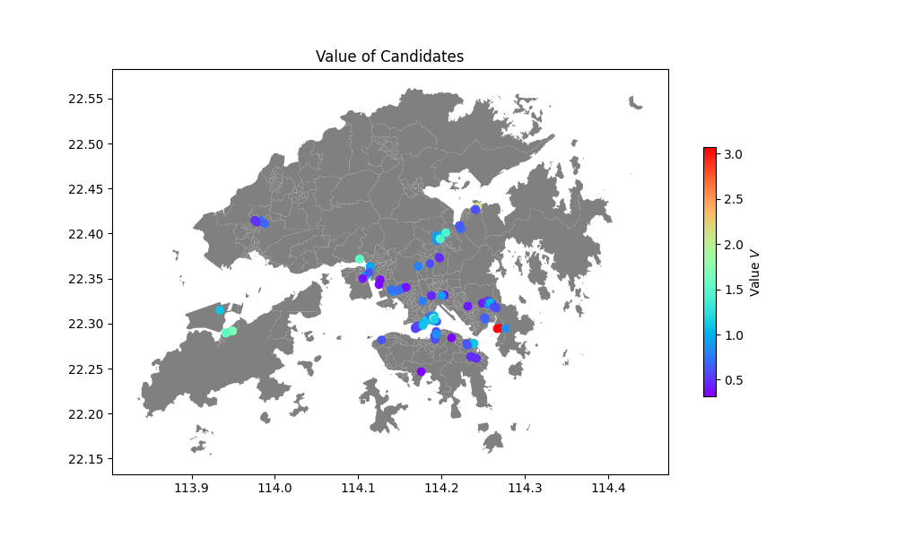

# Composite Geographic site Scoring Model

## Basic strategy on site selection

**Learn the experience of site selection from your competitors.**

Hong Kong is a developed city with small area suitable for human habitation, almost every ecological niche is taken, so you can't find a new niche without competitors. Thus we have to accept this truth and confront with our competitors. 

## Find potential candidate

Find potential candidate sites utilizing experience from other brands' restaurants

We collected the sites of all the restaurants of the following brands:

- Yoshinoya
- McDonald's
- Fairwood
- Cafe de Coral
- KFC

First of all, let visualize the distribution of the sites of Yoshinoya and other brands.

> From the above figure, we can see that the number of current site of Yoshinoya is less than other brands, so we can find more potential candidate sites for Yoshinoya to expand to confront other fast food brands.

Meanwhile, we also calculate the metric=(Median monthly income)*(Working Population) to evaluate the potential purchasing power of each site.

We remove sites of other brands within 1km of Yoshinoya's restaurants. The remaining sites are potential candidate sites for Yoshinoya's new restaurants.

Rent is one of the most important factors to consider when choosing a store location, as the price of rent directly affects the cost of opening a store and the profitability of the business.
Here are the average rent of each district:

## Modelling

Our model consists of 4 sub-models, each of them evaluates different measurement one should care for site selection.

| Sub model                    | Description                                                                                                                                                                                                                | Goal                                                                                       |
| ---------------------------- | -------------------------------------------------------------------------------------------------------------------------------------------------------------------------------------------------------------------------- | ------------------------------------------------------------------------------------------ |
| Modified Similiarity Score   | Measure the similarity between features of candidates and features of exsited Yoshinoya resturant                                                                                                                          | To evaluate how the candidate match the historical pattern of site selection of yoshinoya. |
| Potential Return Value Score | Measure the potential return by the potential purchase power of customers and average rent of shop in the candidate site                                                                                                   | To evaluate how much return if we invest and open a new restruant at this candidate site.  |
| GeoRecommend Model           | Use the customers rating of Yoshinoya and other fast food brands to build a recommend system, in this scenario, we treat each site or geoblock as a user.                                                                  | To evaluate how customers will rating if we open a new restruant at this candiate site     |
| Logistics Regression         | With the exsited distribution data of  Yoshinoya and other fast food brands and demographic data of each site or geoblock, use Logistics Model to regress the likelihood whether there should be a new fast food resturant | To evaluate the likelihood whether one site should have a new fast food restraunt.         |

We linear combine the output score of each sub-model with weight:

$$
Score=\sum_k\omega_k M_k
$$

where $\omega_k$ is the weight of output of the $k^{th}$ model and $M_k$ is the functor of the $k^{th}$ sub-model.

### Modified Similiarity Score

Define the feature of each candidate and current yoshinoya as the feature of the corresponding district in dataset "DCCA_21C.json" which includes data of demography and incomes.

First, let us define the "Modified Similiarity Score" $S$ between the feature of $i^{th}$ feature $Y_i$ and the average feature of current yoshinoya $\bar{X}$ as:

$$
S(Y_i) = \cos(Y_i,\bar{X})\cdot\sqrt{\frac1{\gamma}\frac{d_i}{d_{\min}}-1}
$$

where $\cos(\cdot,\cdot)$ is the cosine similarity function, $d_i$ is the distance between candidate site and the nearest current yoshinoya, and $d_{\min}$ is the excluded distance and the $\gamma$ is a hyparameter for closeness penalty.

This the "Modified Similiarity Score" measures how the candidate match the historical standard of stores' site choosing of yoshinoya.

### GeoRecommend Model

We treat each geoblock as a user in the recommend model named as GeoUser.

Then we can construct a Table for the recommend model like this:

|           | Brand_1 | Brand_2 | Brand_3 | Brand_4 | Brand_5 |
| --------- | ------- | ------- | ------- | ------- | ------- |
| GeoUser 1 | 2/5     |         |         | 3/5     | 4/5     |
| GeoUser 2 | 1/5     | 1/5     | 2/5     |         |         |
| GeoUser 3 |         |         |         | 5/5     | 3/5     |

There are many different recommend algorithm on rating prediction, for simplification, we just use the most naive one, since you don't pay us for work.

#### Rating Predictions

Let the $r_{ij}$ be the rating of the $i^{th}$ GeoUser on $j^{th}$ brand.

Then we can predict $r_{ij}$ with the formula:

$$
r_{ij} = \frac{\sum_ks_{ki}r_{kj}}{\sum_ks_{ki}}
$$

where $s_{ki}$ is the similarity between $k^{th}$ GeoUser and $j^{th}$ GeoUser.

For simplification, we can use the cosine similarity 

$$
s_{ij} = \cos(r_{i:},r_{j:})
$$

Then, we can predict how customers will rating if we open a new restruant at candiate sites.

### Potential Return Value Score

Second, we define the "Potential Purchasing Power" $P$ of each candidate site as:

$$
P(Y_i) = I_i*W_i
$$

where $I_i$ is the median monthly income of the $i^{th}$ candidate site and $W_i$ is the working population of the $i^{th}$ candidate site.

The convenience of transportation is an important factor in site selection, so we will take the distance from the subway station into consideration.

Using sigmoid function, the score $M(Y_i)$ is defined as 

$$
M(Y_i) =  1 / (1 + exp((d_i - threshold) / slope))
$$

where $d_i$ represents the distance from the nearest subway station, threshold and slope are parameters that need to be adjusted.

Then, we define the "Value" $V$ of each candidate site as:

$$
V(Y_i) = \omega_S S(Y_i) + \omega_P \frac{P(Y_i)}{R(Y_i)} + \omega_M M(Y_i)
$$

where $R(Y_i)$ is the average rent of the $i^{th}$ candidate site,
$\omega_S$ and $\omega_P$ are hyparameters for the weight of "Modified Similiarity Score" and "Potential Purchasing Power" respectively.

Best ten candidates:

